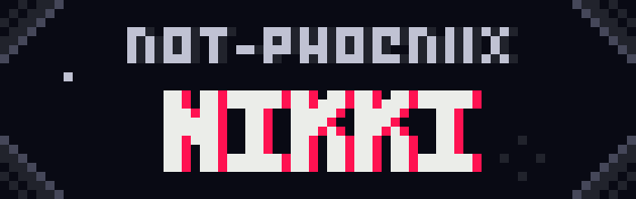

    

    
    
    
    
    
    

 

## About me

Hi there! I'm Nikki and I make stuff :]

I'm currently a second year game design and development student at Rochester Institute of Technology. A lot of the projects here are pebble watchfaces, but I code a bunch of things in a variety of languages. Go check some of em out!

You can reach me on Discord if you'd like, my tag is @not_phoeniix. 

I hope you have a great day!